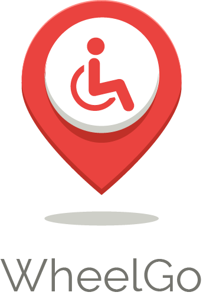

# WheelGo

WheelGo es una aplicación móvil que permite encontrar lugares en la ciudad que tengan acceso inclusivo, enfocado a personas con mobilidad reducida que quieran desplazarse por la ciudad acorde a sus necesidades.

# Tecnologías Utilizadas:

- Here maps
- React
- React Router DOM
- React Bootstrap
- Firebase
- Axios
- Javascript
- CSS
- HTML
- Figma
- Trello

# Desarrolladoras

**Diseño UX:** 

Vanessa González

**Desarrollo Front-End:**

Katherine Muñoz
Fernanda Ocaranza
Camila Osores

